# VPC Networks

## Create Network

### Network

1.เข้าหน้า VPC Network แล้วคลิกที่ปุ่ม "Create" ที่ด้านขวาบน เพื่อสร้าง Network  

2.คลิกที่ปุ่ม "Network"  

3.กรอกข้อมูลและ Setting ต่างๆของ Router โดยมีรายละเอียดดังต่อไปนี้  
   **Name** : ตั้งชื่อของ Router \(ภายในช่องข้อความระบบจะมีชื่อ Default ให้ โดยทางผู้ใช้งานสามารถตั้งชื่อใหม่ได้\)  
   **CIDR** : ระบุว่าที่อยู่ IP จะมีจำนวนบิตเท่าใด  
   **Cloud firewall** : กำหนดว่า Router จะมี Cloud firewall หรือไม่  
   **DHCP** : กำหนดว่า Router จะมี DHCP หรือไม่  
   **Gateway to router** : กำหนดว่า Router จะ Attach Router ไว้หรือไม่  

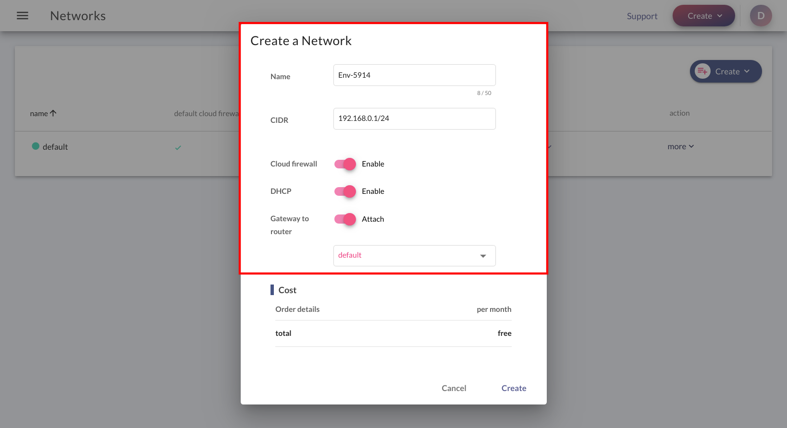

4.คลิกที่ปุ่ม "Create"  

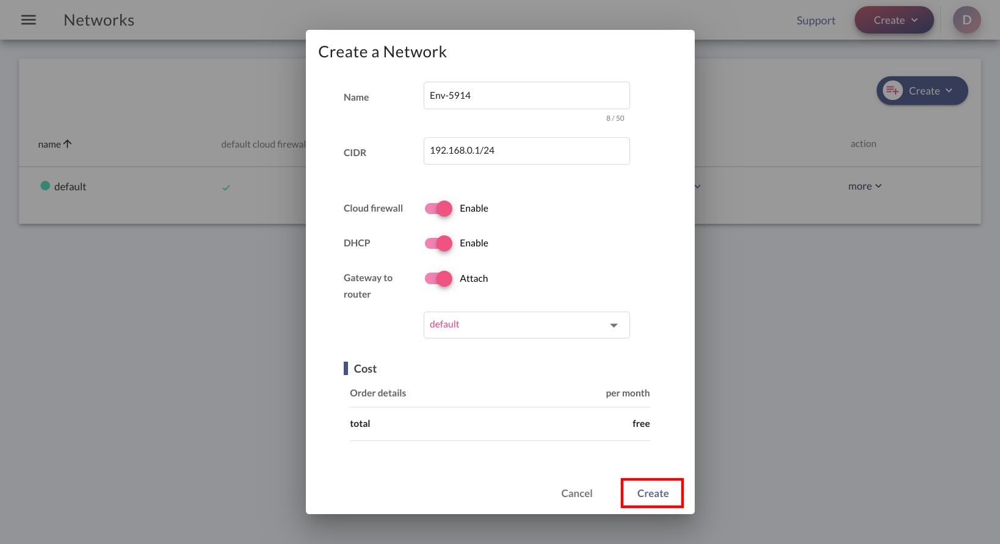

## Action

### Remove

1.คลิกที่ "more"  ใน Column "action" ของ Network ที่ต้องการทำ Action  

2.เลือกเมนู "Remove"  

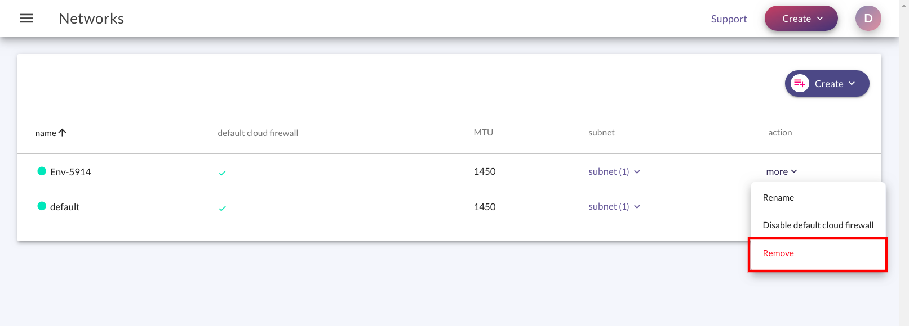

3.ระบบจะแจ้งเตือน Subnet และ Port ที่จะโดนลบไปพร้อมกับ Network ด้วย หากเรายืนยันต้องการจะลบ ให้คลิกที่ปุ่ม "Confirm"  

### Rename

1.คลิกที่ "more"  ใน Column "action" ของ Network ที่ต้องการทำ Action  

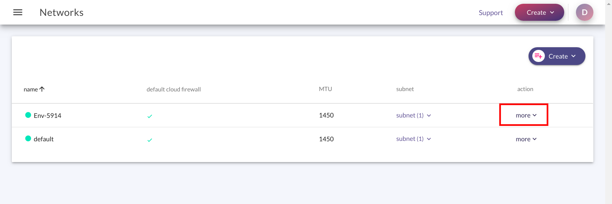

2.เลือกเมนู "Rename"  

3.กรอกชื่อใหม่ที่ต้องการตั้งให้ Router ลงในช่อง แล้วคลิกที่ปุ่ม "Confirm"  

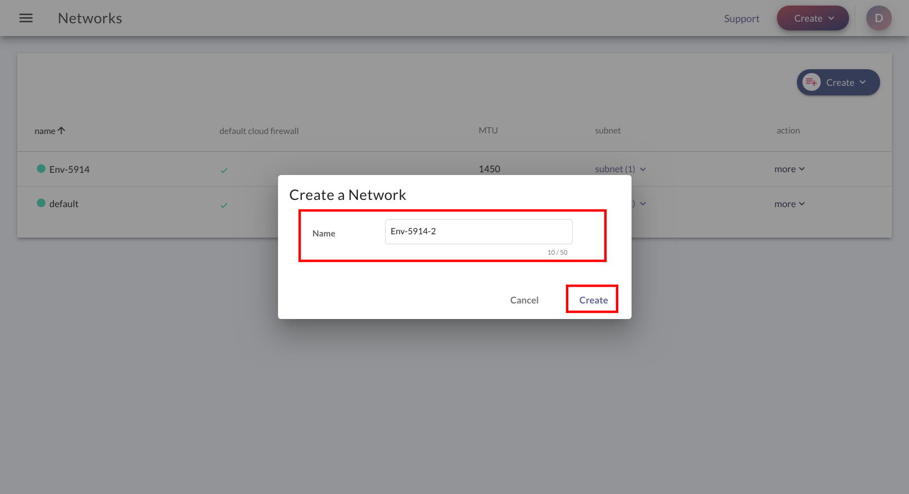

### Disable defualt cloud firewall

1.คลิกที่ "more"  ใน Column "action" ของ Network ที่ต้องการทำ Action  

2.เลือกเมนู "Disable defualt cloud firewall"  

3.คลิกที่ปุ่ม "Disabled"  

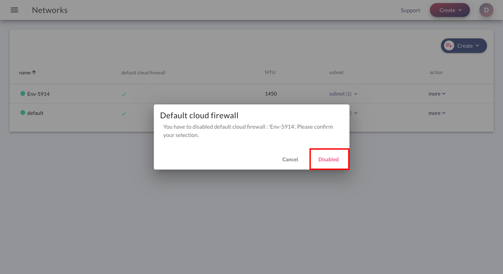

## Setting Subnet

### DHCP

1.คลิกที่ "subnet"  ใน Column "subnet" ของ Network ที่ต้องการ Setting  

2.คลิกที่ปุ่ม "Setting"  

3.คลิกที่สวิตช์ที่มุมขวาบน "Enable/Disable dhcp" เพื่อเปิดหรือปิด DHCP  

4.คลิกที่ปุ่ม "Confirm"  

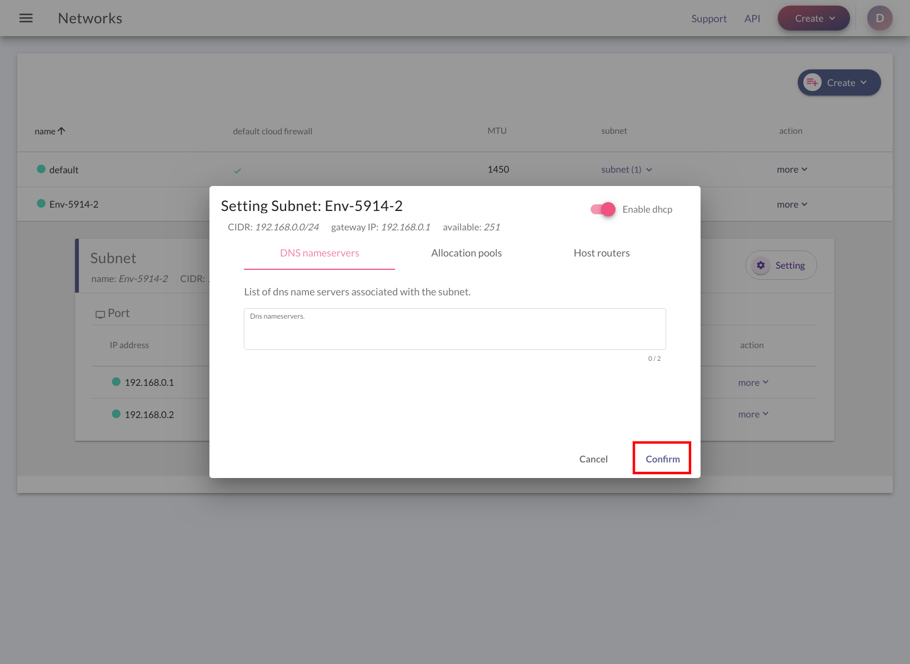

### DNS nameservers

1.คลิกที่ "subnet"  ใน Column "subnet" ของ Network ที่ต้องการ Setting  

2.คลิกที่ปุ่ม "Setting"  

3.เลือกเมนู "DNS nameservers"  

4.กำหนด DNS ลงในช่องข้อความ \(สูงสุด 2 IP\)  

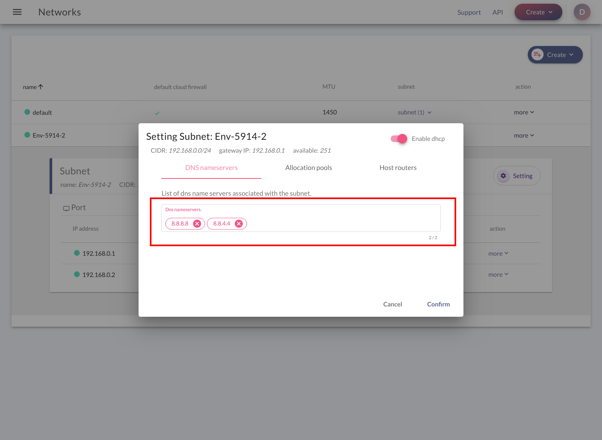

5.คลิกที่ปุ่ม "Confirm"  

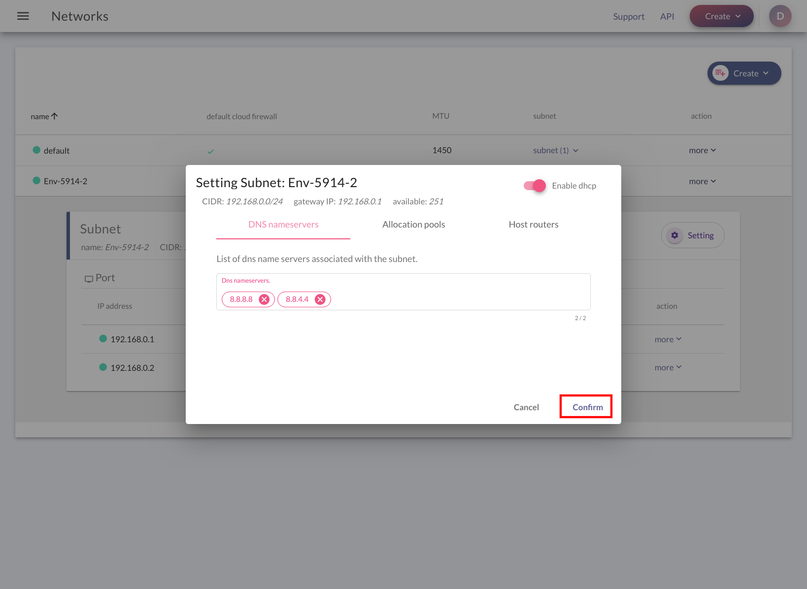

### Allocation pools

**Allocation Pool** คือ ช่วงที่อยู่ IP ใน CIDR Network Block ที่อนุญาตให้ใช้โดยบริการ Cloud หากต้องการยกเว้นที่อยู่ IP บางส่วนจาก Subnet คุณสามารถลดขนาด Pool และเพิ่มช่วงที่อยู่ IP ใหม่ที่ไม่ต่อเนื่องกันได้ \(Non-contiguous IP address range\)

1.คลิกที่ "subnet"  ใน Column "subnet" ของ Network ที่ต้องการ Setting  

2.คลิกที่ปุ่ม "Setting"  

3.เลือกเมนู "Allocation pools"   

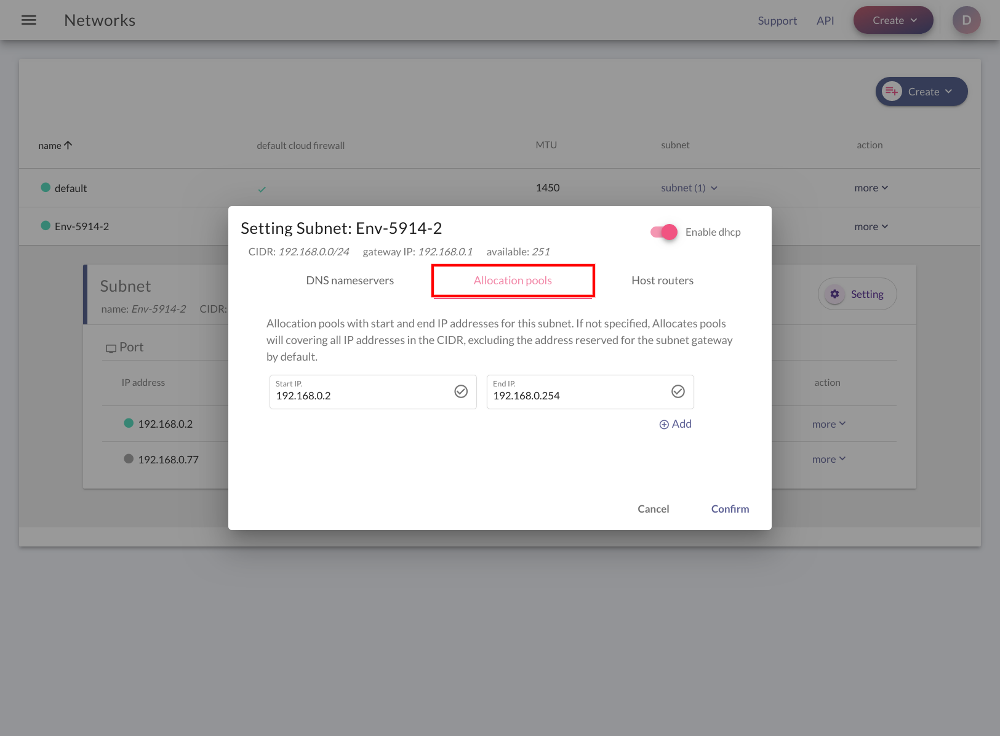

4.คลิกที่สวิตช์ "Set IP addresses" เพื่อเปิดการ Set IP  

5.กำหนด IP Range ลงในช่องข้อความ  

6.คลิกที่ปุ่ม "Add" หากต้องการเพิ่ม IP Range \(Optional\)  

7.คลิกที่ปุ่ม "Confirm"  

### Host router

ใช้ในกรณีต้องการกำหนด Traffic route ไปยัง Gateway ที่ไม่ใช่ Default

1.คลิกที่ "subnet"  ใน Column "subnet" ของ Network ที่ต้องการ Setting  

2.คลิกที่ปุ่ม "Setting"  

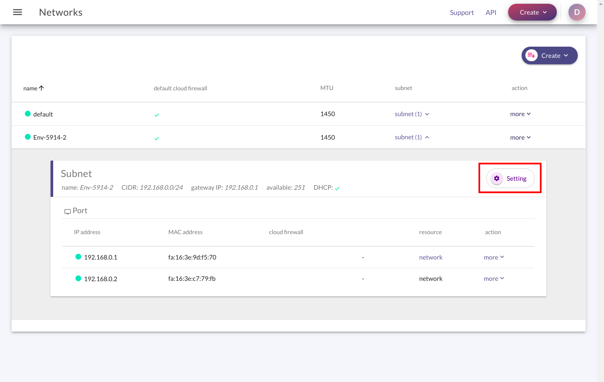

3.เลือกเมนู "Host router"  

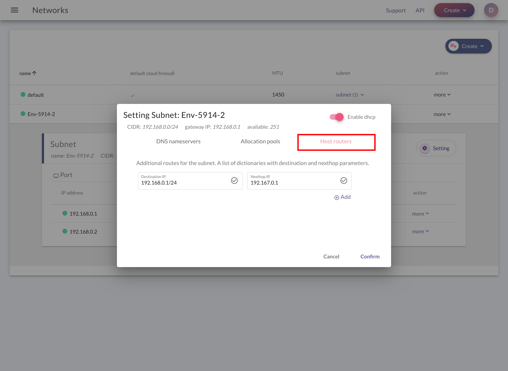

4.กรอกข้อมูลลงในช่องข้อความ  
   **Destination IP** คือ IP ต้นทาง  
   **Nexthop IP** คือ IP ปลายทาง  

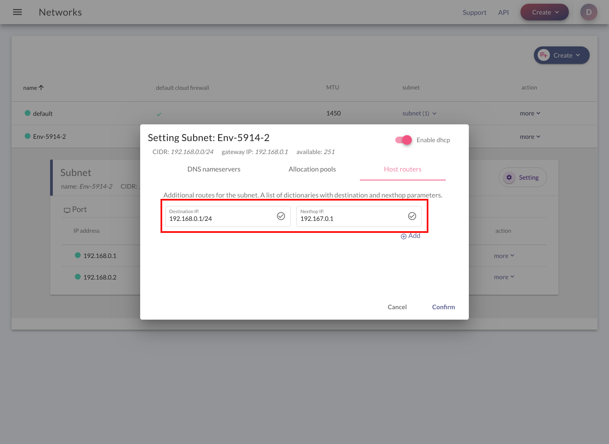

5.คลิกที่ปุ่ม "Add" หากต้องการเพิ่ม Traffic \(Optional\)  

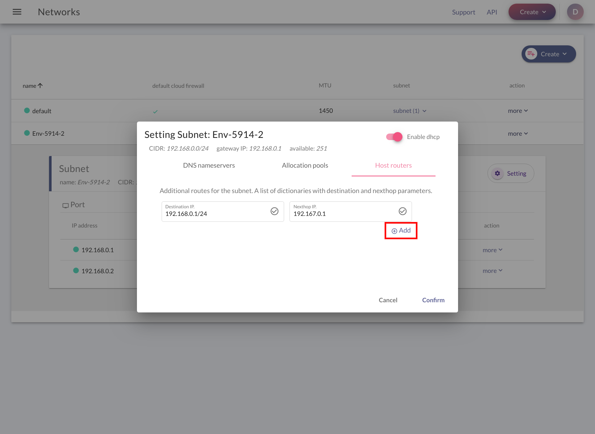

6.คลิกที่ปุ่ม "Confirm"  

## Create Port

### Port

1.เข้าหน้า VPC Network แล้วคลิกที่ปุ่ม "Create" ที่ด้านขวาบน เพื่อสร้าง Port  

2.คลิกที่ "Port"  

3.กรอกข้อมูลและ Setting ต่างๆของ Port โดยมีรายละเอียดดังต่อไปนี้  
   **Name** : ตั้งชื่อของ Port \(ภายในช่องข้อความระบบจะมีชื่อ Default ให้ โดยทางผู้ใช้งานสามารถตั้งชื่อใหม่ได้\)  
   **Network** : กำหนด Network ที่จะสร้าง Port ลงไป  
   **IP Address** : กำหนด IP Address ของ Port  
   **MAC Address** : กำหนด MAC Address ของ Port  
   **Cloud firewall** : กำหนด Cloud firewall ของ Port \( Cloud firewall จะสามารถเลือกประเภทได้ตามที่กำหนดไว้ในหน้า Network -&gt; Cloud Firewalls \)  

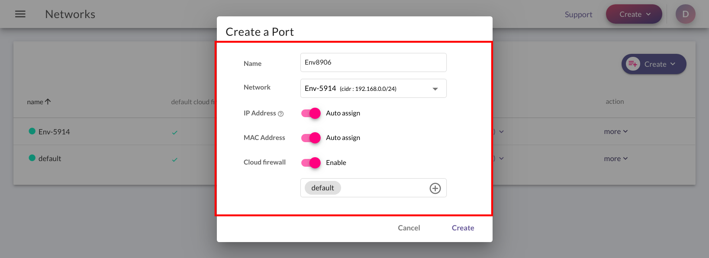

4.คลิกที่ปุ่ม "Create"  

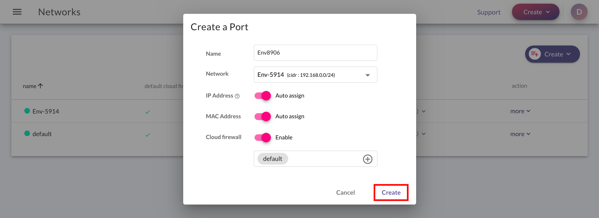

## 

## Action Port

### Enable cloud firewall

1.คลิกที่ "subnet"  ใน Column "subnet" ของ Network ที่ต้องการ Setting  

2.คลิกที่ "more"  ใน Column "action" ของ Port ที่ต้องการ Setiing  

3.เลือกเมนู "Enable cloud firewall"  

4.คลิกที่ปุ่ม "Enabled"  


เมนู "Enable cloud firewall" จะแสดงก็ต่อเมื่อ Port นั้นๆ Disable cloud firewall อยู่


### Disable cloud firewall

1.คลิกที่ "subnet"  ใน Column "subnet" ของ Network ที่ต้องการ Setting  

2.คลิกที่ "more"  ใน Column "action" ของ Port ที่ต้องการ Setiing  

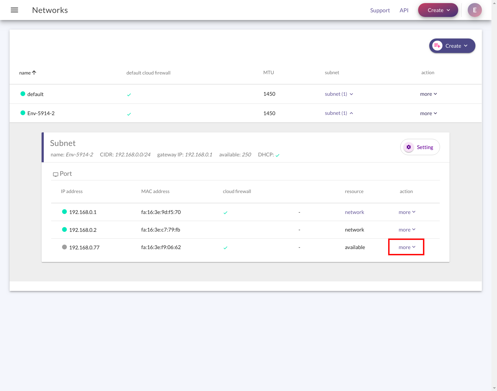

3.เลือกเมนู "Disable cloud firewall"  

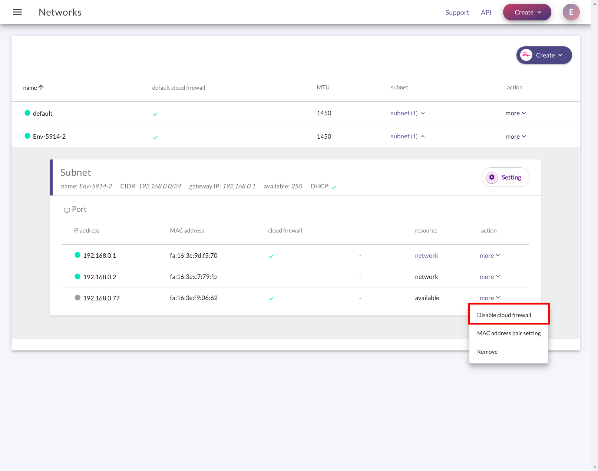

4.คลิกที่ปุ่ม "Disabled"  


เมนู "Disable cloud firewall" จะแสดงก็ต่อเมื่อ Port นั้นๆ Enable cloud firewall อยู่


###  Mac address pair setting

ใช้ในกรณีต้องการกำหนด MAC/IP address \(range\)  เพิ่มลงไปใน Port มีขั้นตอนดังนี้

1.คลิกที่ "subnet"  ใน Column "subnet" ของ Network ที่ต้องการ Setting  

2.คลิกที่ "more"  ใน Column "action" ของ Port ที่ต้องการ Setiing  

3.เลือกเมนู "Mac address pair setting"  

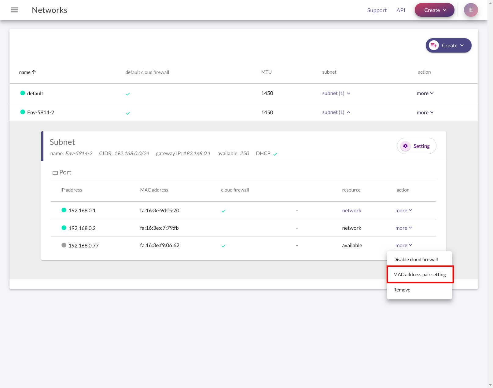

4.กรอกข้อมูลลงในช่องข้อความ  
   **IP Address or CIDR** : กำหนด IP Address ของ Port \(สามารถกำหนดเป็น CIDR ได้\)  
   **MAC Address** : กำหนด MAC Address ของ Port  

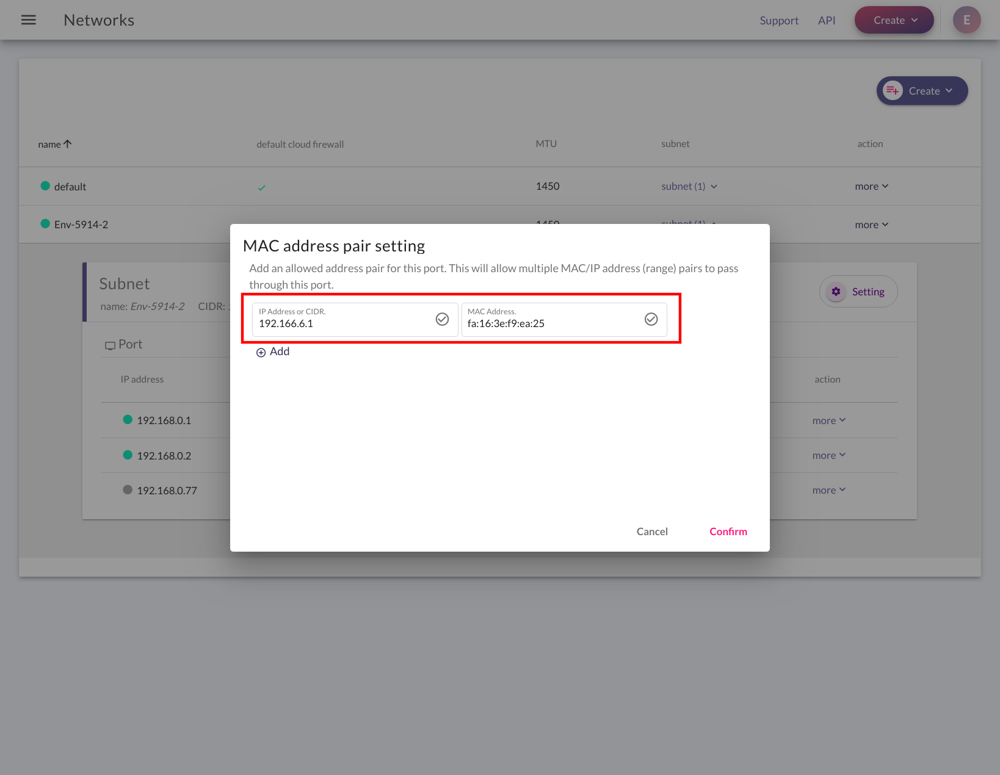

5.คลิกที่ปุ่ม "Add" หากต้องการเพิ่ม MAC/IP Address \(Optional\)

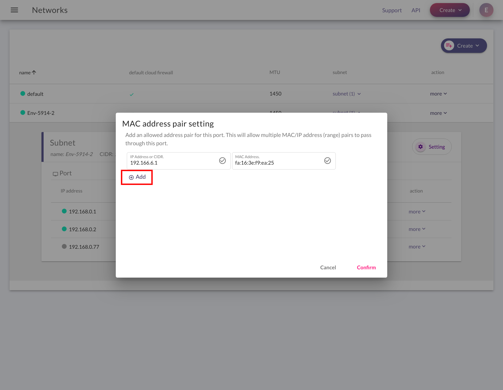

6.คลิกที่ปุ่ม "Confirm"  

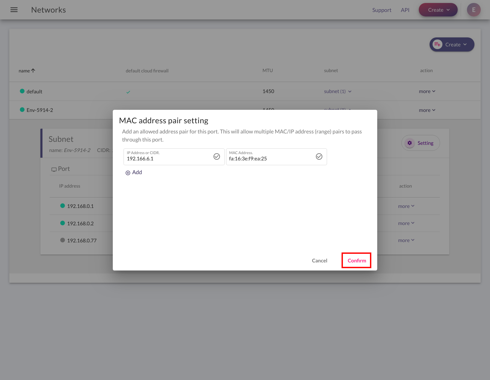


เมนู "Mac address pair setting" จะแสดงก็ต่อเมื่อ Port นั้นๆ Enable cloud firewall อยู่


### Remove

1.คลิกที่ "subnet"  ใน Column "subnet" ของ Network ที่ต้องการ Setting  

2.คลิกที่ "more"  ใน Column "action" ของ Port ที่ต้องการ Remove  

3.เลือกเมนู "Remove"   

4.คลิกที่ปุ่ม "Confirm"  

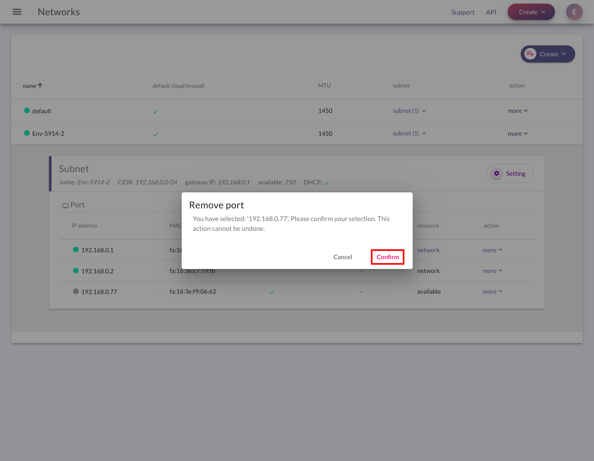


เมนู "Remove" จะแสดงก็ต่อเมื่อเป็น Port ที่ผู้ใช้งานสร้างขึ้น


